# 图书管理系统数据库课程实验报告

## 摘要

本项目设计并实现了一个面向高校图书馆的图书管理系统。系统采用 Vue 3、Flask 和 MySQL 8 构建，包含学生端与管理员端两类用户界面，支持图书检索、借书、还书、延期、预约、违期处理、图书与馆藏副本管理、学生与管理员管理、附件上传等功能。

本项目将数据库设计与数据库业务逻辑作为实现重点。系统使用规范化关系模式保存业务数据，通过主键、外键、唯一约束、检查约束和索引保证数据质量；通过触发器生成业务长编码并同步馆藏状态；通过存储过程和事务实现借书、还书、延期、修改预约时间和修改图书简介等核心操作；通过函数计算违期天数与罚金。

**项目仓库：** <https://github.com/ivanW2353/database_lab2>

---

## 1. 前期设计

### 1.1 项目背景

传统图书馆业务涉及图书、馆藏副本、学生、管理员、借阅、预约和违期等多类数据。若仅在应用程序中维护这些数据，容易出现馆藏状态与借阅状态不一致、重复借阅、历史记录丢失等问题。

本系统使用关系数据库统一保存业务数据，并将关键完整性规则和业务流程放入数据库中执行，使系统能够可靠地处理多表关联、并发修改和历史记录查询。

### 1.2 系统目标

系统需要完成以下目标：

1. 管理图书书目、馆藏副本、作者、出版社、分类及附件资料。
2. 支持学生注册、登录、检索图书、借书、还书、延期和预约。
3. 支持管理员管理图书、学生和管理员账号，并办理流通业务。
4. 自动维护馆藏副本状态，避免同一副本被重复借出。
5. 自动计算违期天数与罚金，保留完整历史记录。
6. 使用数据库分页、关联查询、触发器、函数、存储过程和事务。

### 1.3 用户角色与需求分析

#### 1.3.1 学生

学生使用学号和密码登录，主要功能包括：

- 检索和查看图书详情。
- 查看馆藏副本与可借数量。
- 借出有库存的图书。
- 无库存时自动加入预约队列。
- 选择未来日期提交预约，并修改有效预约时间。
- 查看、延期和归还本人借阅记录。
- 查看违期开始日期、违期天数、罚金及缴纳状态。
- 维护个人信息和修改密码。

#### 1.3.2 图书管理员

管理员使用工号和密码登录，主要功能包括：

- 新增图书、馆藏副本和图书附件。
- 查看图书详情及该书全部历史借阅记录。
- 修改图书简介。
- 新增、查询和删除学生账号。
- 查看学生详情及该学生全部历史借阅记录。
- 新增、查询、删除或停用管理员账号。
- 办理借书、还书、预约状态更新和罚金缴清。

### 1.4 数据需求

系统的主要数据对象如下。

| 数据对象 | 主要内容 |
|---|---|
| 学生 | 学号、姓名、学院、专业、联系方式、学生类型、状态 |
| 管理员 | 工号、姓名、联系方式、职位、状态 |
| 图书 | ISBN、书名、分类、出版社、出版信息、简介 |
| 馆藏副本 | 所属图书、条码、馆藏位置、状态、入库日期 |
| 作者 | 姓名、国籍、简介 |
| 借阅规则 | 最大借阅数、借阅天数、最大延期次数、每日罚金 |
| 借阅记录 | 学生、副本、借还时间、延期次数、状态 |
| 预约记录 | 学生、图书、计划借出日期、过期时间、状态 |
| 违期记录 | 借阅记录、违期天数、罚金、缴纳状态 |
| 图书附件 | 图书、资料类型、文件路径、MIME 类型、文件大小 |

### 1.5 E-R 图

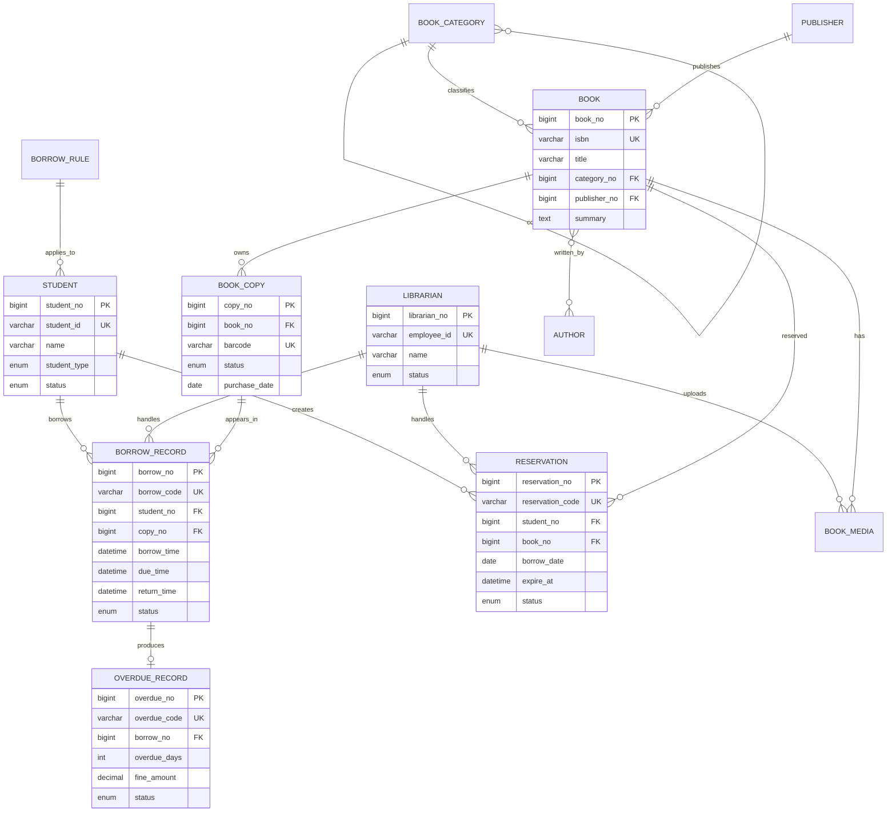

### 1.6 关系模式设计

系统共设计 14 张表。

| 关系模式 | 主键 | 重要外键或候选键 | 作用 |
|---|---|---|---|
| `student` | `student_no` | `student_id` 唯一 | 保存学生信息 |
| `librarian` | `librarian_no` | `employee_id` 唯一 | 保存管理员信息 |
| `book_category` | `category_no` | `parent_no` 自关联 | 保存层次化分类 |
| `publisher` | `publisher_no` | `publisher_name` 唯一 | 保存出版社 |
| `author` | `author_no` | 姓名与国籍联合唯一 | 保存作者 |
| `book` | `book_no` | `isbn` 唯一，关联分类和出版社 | 保存书目信息 |
| `book_author` | `book_no, author_no` | 分别关联图书和作者 | 解决图书与作者多对多关系 |
| `book_copy` | `copy_no` | `barcode` 唯一，关联图书 | 保存实体馆藏副本 |
| `borrow_rule` | `rule_no` | `student_type` 唯一 | 保存借阅规则 |
| `business_sequence` | `business_type, business_date` | 联合主键 | 生成每天的业务顺序码 |
| `borrow_record` | `borrow_no` | 关联学生、副本和管理员 | 保存借阅历史 |
| `reservation` | `reservation_no` | 关联学生、图书和管理员 | 保存预约历史 |
| `overdue_record` | `overdue_no` | `borrow_no` 唯一 | 保存违期和罚金 |
| `book_media` | `media_no` | 关联图书和上传管理员 | 保存附件元数据 |

### 1.7 模式设计原则

#### 1.7.1 图书与馆藏副本分离

`book` 保存 ISBN、书名和出版社等公共书目信息；`book_copy` 保存每一本实体书的条码、位置和状态。这样可以避免重复保存书目信息，并支持同一种图书拥有多个副本。

#### 1.7.2 内部主键与业务编码分离

各业务表使用自增主键进行内部关联，同时使用业务长编码向用户展示：

```text
借阅编码：BR202606040001
预约编码：RV202606040001
违期编码：OD202606040001
```

该设计既保证外键关联效率，也使业务记录具有可读性。

#### 1.7.3 历史数据保留

已有借阅或预约记录的学生不允许直接物理删除。已有业务记录的管理员会被停用，而不是直接删除，以保证历史记录中的外键关系有效。

#### 1.7.4 完整性约束

- 主键保证每条记录唯一。
- 学号、工号、ISBN、条码和业务编码设置唯一约束。
- 外键保证多表引用有效。
- `ENUM` 限制状态字段的可选值。
- `CHECK` 和触发器校验中科大学号格式。
- 索引加速学生借阅状态、馆藏借阅状态和预约队列查询。

---

## 2. 实现说明

### 2.1 技术选型

| 层次 | 技术 | 作用 |
|---|---|---|
| 前端 | Vue 3、Vite、Tabler | 页面展示、交互和组件化开发 |
| 后端 | Flask | 提供 JSON API、登录鉴权和参数处理 |
| 数据库 | MySQL 8、InnoDB | 保存数据并实现事务、触发器和存储过程 |
| 测试 | Python `unittest` | 验证接口、数据库规则和业务流程 |

### 2.2 系统框架结构

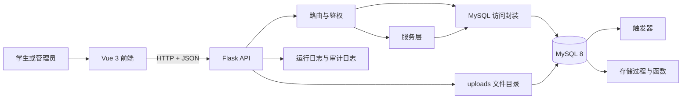

项目目录按照前后端和数据库脚本分层：

```text
backend/        Flask API、服务层、模型和数据库访问工具
frontend/       Vue 页面、公共组件和 API 请求封装
database/       建表、初始数据、示例数据和数据库业务脚本
docs/           需求分析、API、使用说明和实验报告
tests/          自动化测试
uploads/        上传附件文件
logs/           运行日志和审计日志
```

### 2.3 核心数据库实现

#### 2.3.1 业务长编码生成

借阅、预约和违期记录的业务编码由数据库触发器生成。触发器按业务类型和日期更新 `business_sequence`，然后拼接前缀、日期和四位顺序码。

```sql
INSERT INTO business_sequence (business_type, business_date, current_value)
VALUES ('borrow', CURDATE(), LAST_INSERT_ID(1))
ON DUPLICATE KEY UPDATE current_value = LAST_INSERT_ID(current_value + 1);

SET NEW.borrow_code =
  CONCAT('BR', DATE_FORMAT(CURDATE(), '%Y%m%d'),
         LPAD(LAST_INSERT_ID(), 4, '0'));
```

编码生成由数据库统一完成，避免多个前端或后端入口各自生成编码造成冲突。

#### 2.3.2 借书事务

借书操作调用 `sp_borrow_book` 存储过程。该过程在事务中完成以下操作：

1. 锁定并检查学生状态。
2. 查询对应学生类型的借阅规则。
3. 检查当前借阅数量。
4. 检查是否存在未缴违期罚金。
5. 使用 `FOR UPDATE` 锁定馆藏副本。
6. 插入借阅记录。
7. 由触发器将副本状态改为 `borrowed`。

若任何步骤失败，异常处理器执行 `ROLLBACK`，从而避免借阅记录和馆藏状态不一致。

#### 2.3.3 还书与违期计算

还书操作调用 `sp_return_book`。存储过程首先校验借阅记录是否有效，再更新归还时间和借阅状态。若已经超过应还时间，则调用函数计算违期天数和罚金，并写入 `overdue_record`。

```sql
SET v_days = fn_overdue_days(v_due_time, v_return_time);

IF v_days > 0 THEN
  INSERT INTO overdue_record (borrow_no, overdue_days, fine_amount)
  VALUES (p_borrow_no, v_days,
          fn_overdue_fine(v_days, v_fine_per_day));
END IF;
```

违期开始日期在查询时使用 `应还日期 + 1 天` 计算，使页面能明确显示从哪一天开始违期。

#### 2.3.4 延期处理

延期操作调用 `sp_renew_borrow`，数据库负责验证：

- 记录属于当前学生。
- 借阅状态为借出中。
- 当前时间没有超过应还时间。
- 延期次数没有超过借阅规则。
- 学生没有未缴罚金。

满足条件后，数据库更新应还时间和延期次数。

#### 2.3.5 预约日期修改

`sp_update_reservation_date` 只允许学生修改本人状态为“待处理”或“已通知”的预约，并要求计划借出日期晚于当天。修改预约日期时，数据库同步更新预约过期时间。

#### 2.3.6 馆藏状态同步

借阅记录插入后，触发器自动将副本状态改为借出；借阅记录更新为已归还或丢失后，触发器同步更新馆藏副本状态。

该设计将状态一致性规则放在数据库中，因此无论借书操作来自学生端还是管理员端，都能执行相同规则。

#### 2.3.7 数据库分页与关联查询

图书、学生、管理员、借阅、还书和预约列表均使用数据库分页。后端先执行 `COUNT(*)` 获取总数，再通过 `LIMIT` 和 `OFFSET` 读取当前页。

管理员查看图书详情时，系统关联：

```text
book -> book_copy -> borrow_record -> student
```

管理员查看学生详情时，系统关联：

```text
student -> borrow_record -> book_copy -> book
```

这种查询方式避免在应用程序中进行多次循环查询。

### 2.4 核心应用实现

#### 2.4.1 Flask API

后端按业务模块拆分路由：

| 文件 | 主要职责 |
|---|---|
| `routes/auth.py` | 登录、注册、退出和当前用户 |
| `routes/student.py` | 学生借阅、预约、违期和个人信息 |
| `routes/admin_books.py` | 图书、副本、简介和附件管理 |
| `routes/admin_users.py` | 学生和管理员管理 |
| `routes/admin_circulation.py` | 管理员借书、还书、预约和违期处理 |

需要权限的接口通过统一装饰器校验登录角色。学生只能操作本人借阅和预约记录，管理员接口仅管理员可以访问。

#### 2.4.2 Vue 前端

前端使用组件化方式实现：

- `SortableTable.vue`：统一表格排序、状态中文显示和学生类型中文显示。
- `PaginationControls.vue`：统一分页信息和翻页按钮。
- `BookDetailModal.vue`：统一图书详情、馆藏副本、附件和借阅历史展示。
- 页面组件负责调用 API 和处理具体业务操作。

#### 2.4.3 文件上传

管理员选择图书和本地文件后上传。文件保存到：

```text
uploads/books/<book_no>/
```

数据库 `book_media` 表只保存文件相对路径、标题、MIME 类型、文件大小和上传管理员。这样可以避免将大体积二进制文件直接存入数据库，同时仍能通过数据库管理文件元数据。

### 2.5 安全性与可靠性

- 密码只保存哈希值，不保存明文密码。
- Flask Session 保存登录状态。
- API 按学生和管理员角色进行权限校验。
- 学生只能修改和归还本人记录。
- 数据库事务保证核心业务的原子性。
- 数据库约束和触发器保证数据完整性。
- 运行日志记录异常，审计日志记录关键业务操作。

### 2.6 测试情况

项目使用 Python `unittest` 编写自动化测试，覆盖：

- 登录、注册和权限控制。
- 图书查询、详情、分页、简介修改和附件上传。
- 学生借书、还书、延期及无库存预约队列。
- 预约创建、修改日期、取消和权限校验。
- 管理员借书、还书、学生详情、列表排序、违期和罚金处理。
- 密码、学号、电话、邮箱和 SQL 转义工具。

整理项目后执行完整测试：

```text
后端自动化测试：39 项全部通过
前端生产构建：通过
git diff --check：通过
```

---

## 3. 结果展示


### 3.1 登录与首页

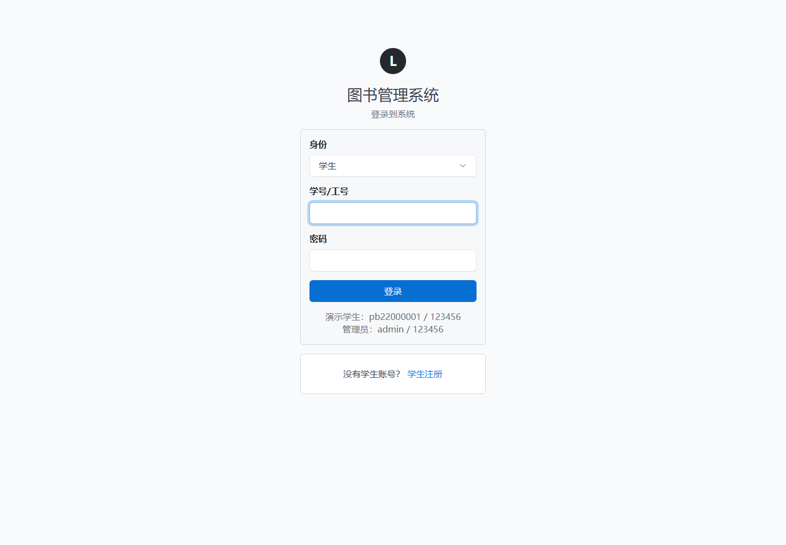

**图 1 登录页面。** 展示学生和管理员身份选择、学生注册入口及登录表单。

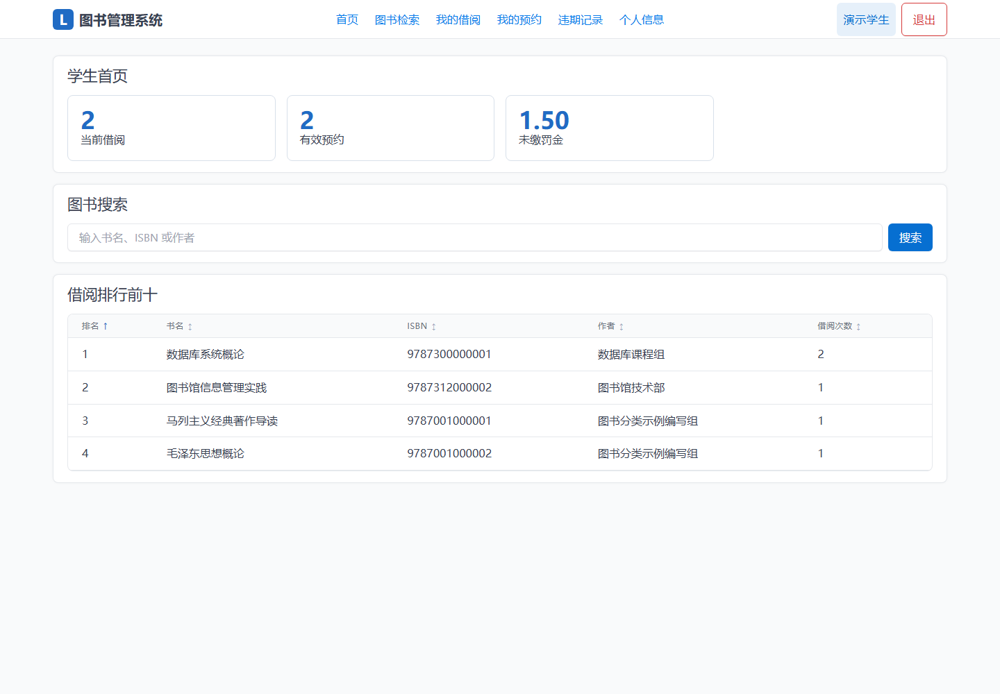

**图 2 学生首页。** 展示个人借阅、预约、罚金统计和热门图书排行。

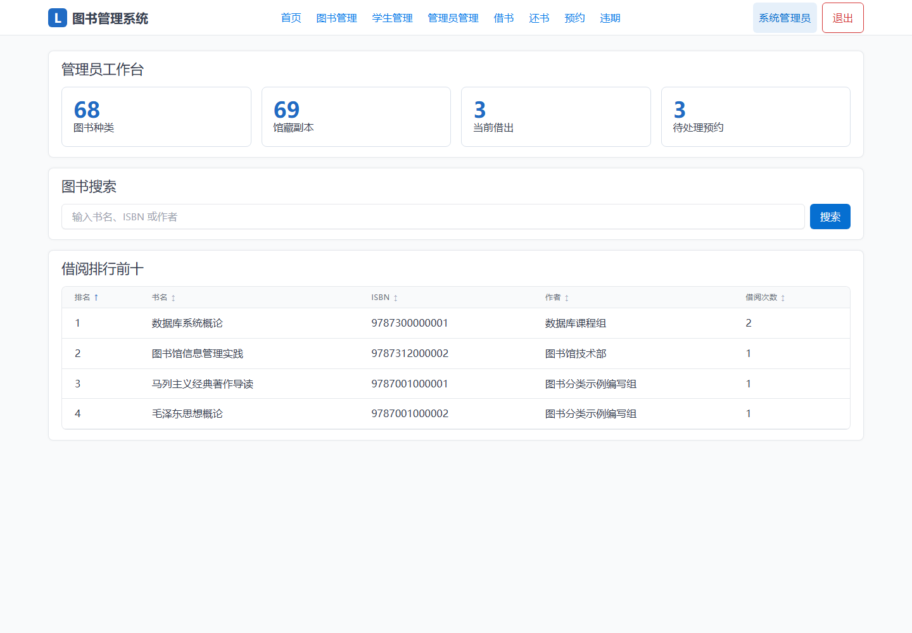

**图 3 管理员首页。** 展示系统整体统计信息和历史借阅排行。

### 3.2 图书检索与详情

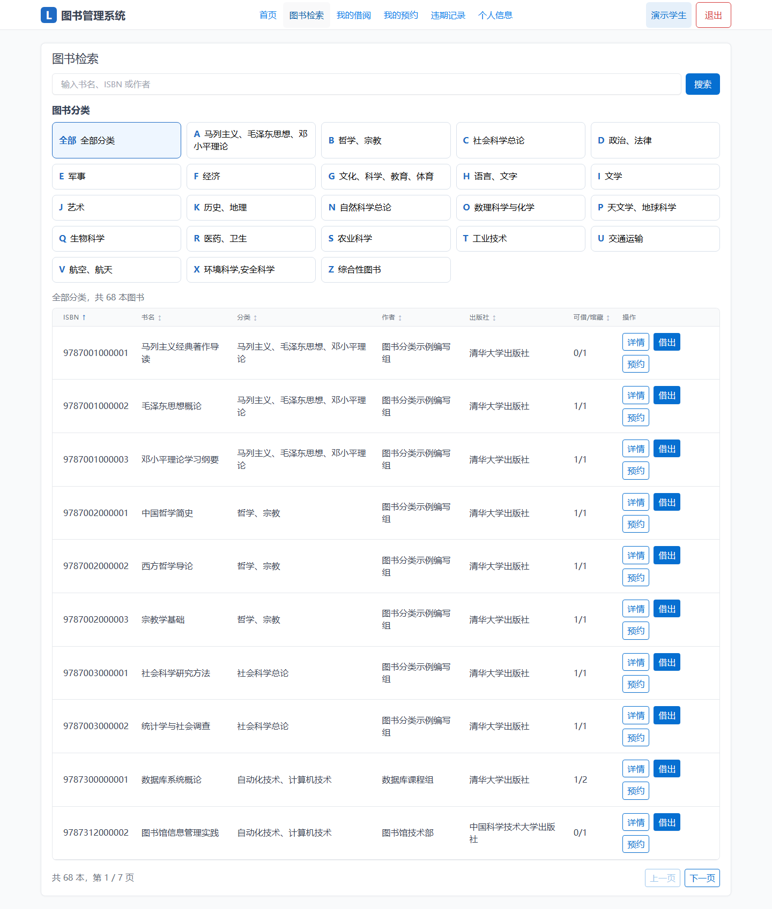

**图 4 图书检索页面。** 展示分类检索、关键词搜索、可借数量和数据库分页。

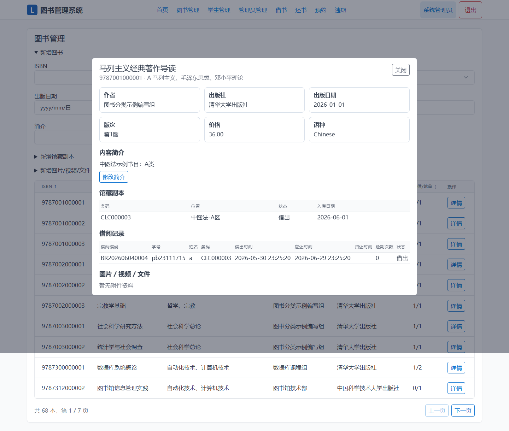

**图 5 管理员图书详情。** 展示图书简介、馆藏副本、附件资料和该书借阅历史。

### 3.3 学生借阅与预约

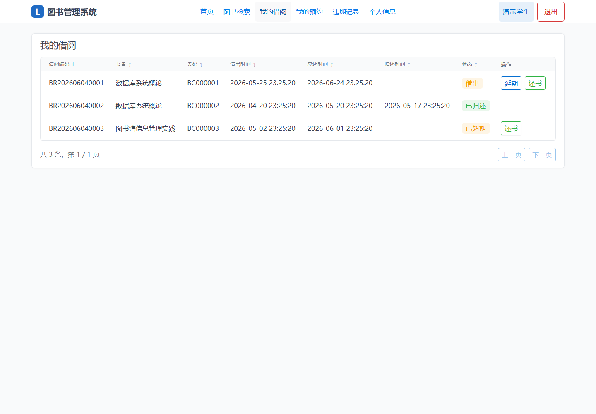

**图 6 学生借阅记录。** 展示借阅业务编码、应还时间、状态、还书和延期按钮。

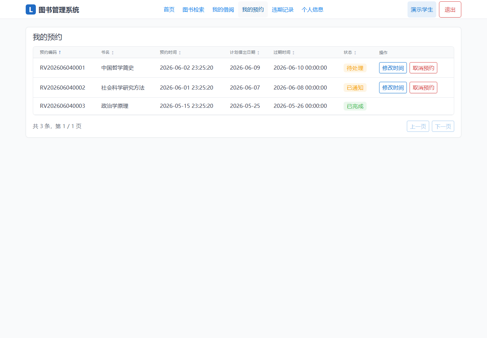

**图 7 学生预约记录。** 展示预约业务编码、计划借出日期、修改时间和取消预约操作。

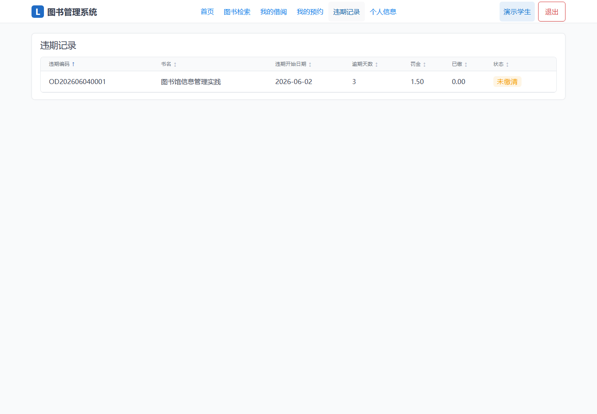

**图 8 学生违期记录。** 展示违期业务编码、违期开始日期、违期天数和罚金状态。

### 3.4 管理员业务管理

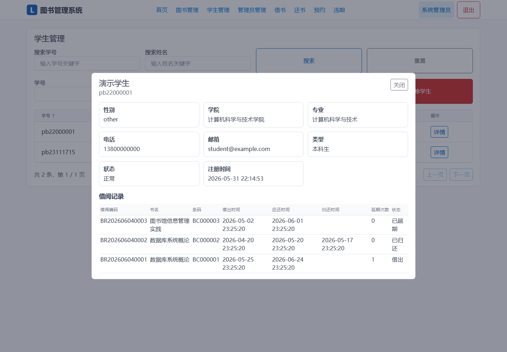

**图 9 学生管理页面。** 学生列表按学号排序，不显示内部编号；详情中显示学生资料和全部借阅历史。

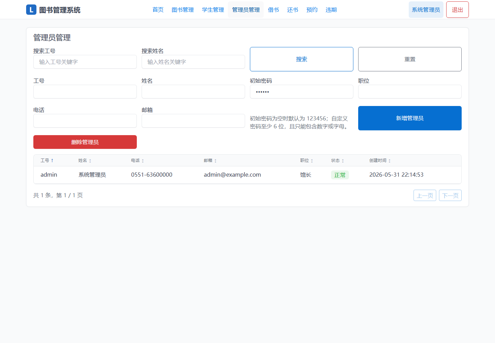

**图 10 管理员管理页面。** 管理员列表按工号排序，不显示内部编号。

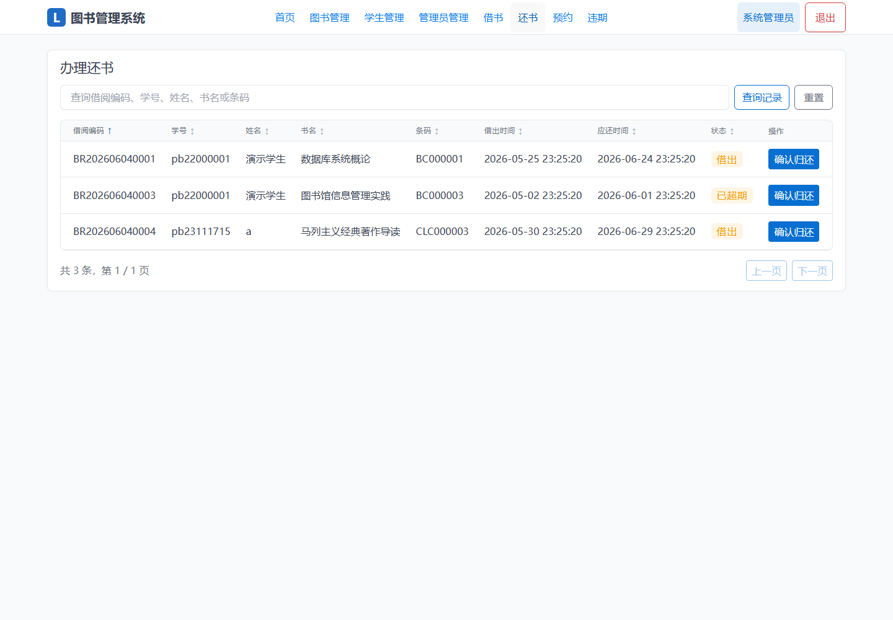

**图 11 管理员还书页面。** 展示借阅记录查询和每条记录后的确认归还按钮。

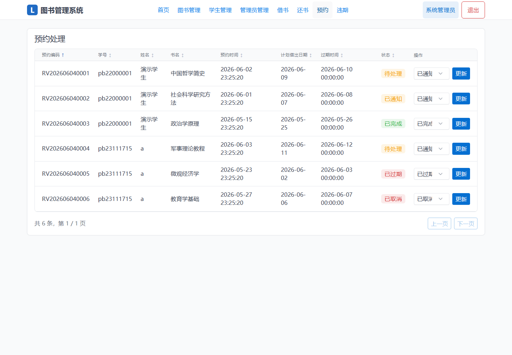

**图 12 管理员预约处理页面。** 展示预约编码、学生、计划借出日期和状态更新操作。

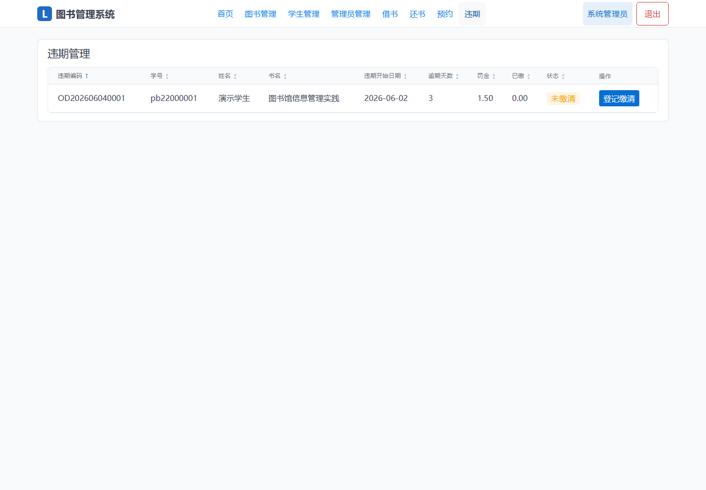

**图 13 管理员违期处理页面。** 展示违期开始日期、罚金和缴清处理。

### 3.5 数据库实现展示

建议在数据库客户端中补充以下截图：

1. 数据库表及外键关系。
2. `business_sequence` 表和业务长编码记录。
3. `sp_borrow_book`、`sp_return_book` 等存储过程。
4. 借书前后 `book_copy.status` 的变化。
5. 超期还书后自动生成的 `overdue_record`。
6. 自动化测试 39 项通过的终端输出。

---

## 4. 项目特色

1. **数据库承担核心业务。** 借书、还书、延期、预约修改和简介修改通过存储过程完成。
2. **完整性规则集中。** 触发器统一生成业务编码并维护馆藏状态。
3. **事务保证一致性。** 核心流通业务发生异常时自动回滚。
4. **书目与实体副本分离。** 支持一本图书对应多个可独立借阅的馆藏副本。
5. **保留历史记录。** 使用状态停用代替直接删除，保证外键关系和历史业务可追溯。
6. **界面不暴露内部主键。** 学生列表使用学号，管理员列表使用工号，业务列表使用长编码。
7. **数据库分页。** 大型列表只读取当前页数据，降低后端和前端处理压力。

---

## 5. 总结

本实验完成了图书管理系统从需求分析、E-R 建模、关系模式设计到前后端实现和测试验证的全过程。项目重点使用了关系数据库中的主键、外键、唯一约束、检查约束、索引、触发器、函数、存储过程和事务。

通过本项目可以看出，将关键业务规则放入数据库能够有效保证数据一致性。例如，借书操作不仅插入借阅记录，还需要验证学生状态、借阅上限、罚金状态和馆藏状态；使用存储过程、行锁和事务可以保证这些操作作为一个整体成功或失败。触发器则保证了不同业务入口下馆藏状态和业务编码规则的一致性。

后续可继续扩展管理员对借阅规则的可视化配置、预约到期自动处理、附件在线预览、统计报表和更细粒度的权限管理。
