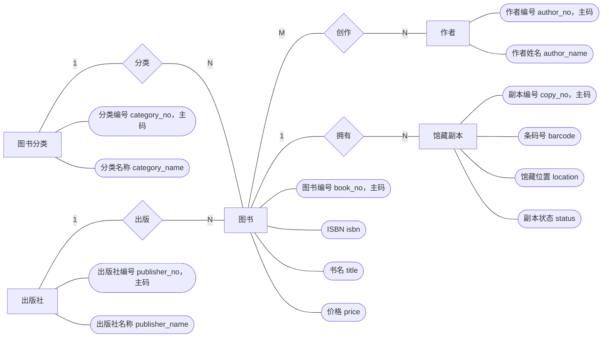
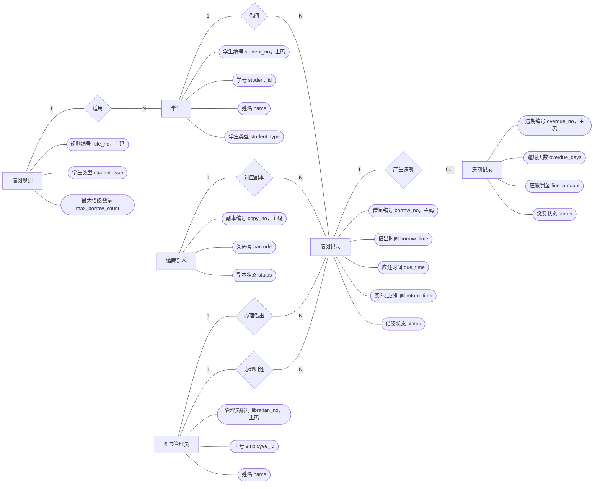
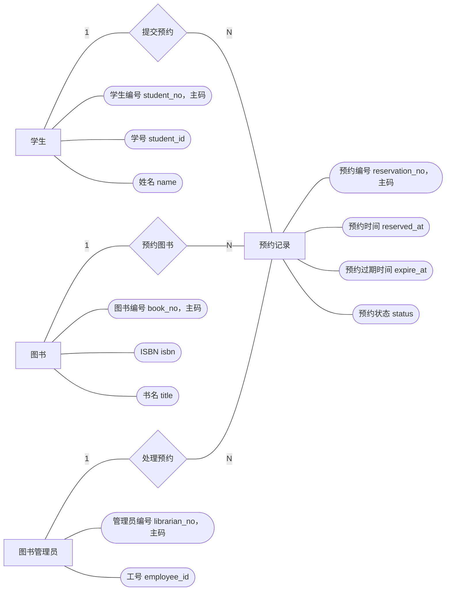
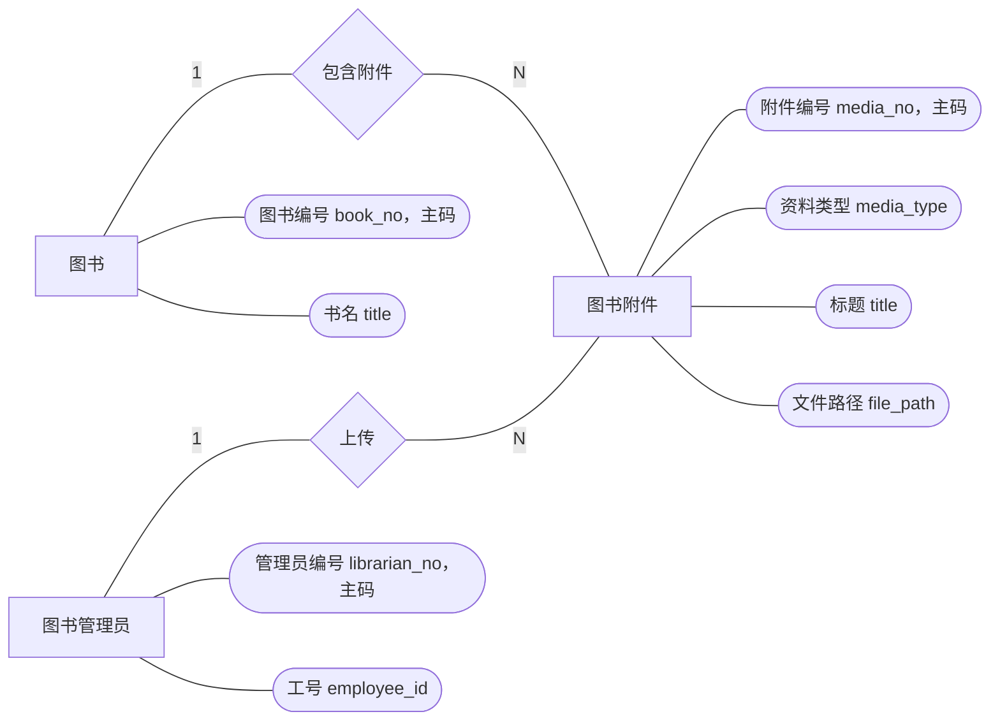

# 图书管理系统需求分析与 E-R 图

## 1. 系统目标

图书管理系统用于管理学校图书馆的图书资料、馆藏副本、学生借阅、图书预约、逾期违期、罚金和图书附件资料等业务。

系统应支持学生检索图书、预约图书、查看个人借阅记录和违期记录；支持图书管理员维护图书、馆藏副本、学生信息，办理借书、还书、预约处理和逾期处理等操作。

## 2. 用户角色

| 角色 | 主要职责 |
| --- | --- |
| 学生 | 登录系统，检索图书，预约图书，查看本人借阅记录、预约记录和违期记录 |
| 图书管理员 | 管理图书、馆藏副本、学生信息，办理借书还书，处理预约和违期罚金 |
| 系统管理员 | 管理管理员账号、基础参数、借阅规则和系统日志 |

字段命名说明：

- `no` 表示系统内部编号，例如学生编号 `student_no`、图书编号 `book_no`、副本编号 `copy_no`。
- `id` 表示业务身份号，例如学号 `student_id`、工号 `employee_id`。

## 3. 数据需求

### 3.1 学生信息

学生信息用于记录借阅图书的学生基础资料。

主要数据项：

- 学生编号：`student_no`
- 学号：`student_id`
- 密码哈希：`password_hash`
- 姓名：`name`
- 性别：`gender`
- 学院：`college`
- 专业：`major`
- 联系电话：`phone`
- 邮箱：`email`
- 学生类型：`student_type`，本科生
- 学生状态：`status`，正常、暂停借阅、注销

说明：

- 学生使用学号和个人密码登录系统。
- 学生状态用于控制借阅资格。
- “正常”表示可以登录、借书和预约。
- “暂停借阅”表示账号存在，但暂时不能借书或预约，例如存在严重逾期或未缴罚金。
- “注销”表示学生账号不再使用，但历史借阅记录仍需保留。

### 3.2 图书管理员信息

图书管理员信息用于记录图书馆工作人员基础资料。

主要数据项：

- 管理员编号：`librarian_no`
- 工号：`employee_id`
- 密码哈希：`password_hash`
- 姓名：`name`
- 电话：`phone`
- 邮箱：`email`
- 职位：`position`
- 管理员状态：`status`，正常、停用

### 3.3 图书分类信息

图书分类信息用于支持图书分类管理、分类查询和统计。

主要数据项：

- 分类编号：`category_no`
- 父级分类编号：`parent_no`
- 分类编码：`category_code`
- 分类名称：`category_name`

说明：图书分类采用《中国图书馆分类法》的分类编码体系，并支持父子分类。例如 `T` 表示工业技术，`TP` 表示自动化技术、计算机技术。

### 3.4 出版社信息

出版社信息用于记录图书出版单位。

主要数据项：

- 出版社编号：`publisher_no`
- 出版社名称：`publisher_name`
- 地址：`address`
- 联系电话：`phone`

### 3.5 作者信息

作者信息用于记录图书作者资料。

主要数据项：

- 作者编号：`author_no`
- 作者姓名：`author_name`
- 国籍：`nationality`
- 简介：`biography`

说明：一本图书可以有多个作者，一个作者也可以编写多本图书，因此图书和作者之间是多对多关系。

### 3.6 图书信息

图书信息用于记录书目层面的图书资料，即同一 ISBN 对应的一类图书。

主要数据项：

- 图书编号：`book_no`
- ISBN：`isbn`
- 书名：`title`
- 所属分类编号：`category_no`
- 出版社编号：`publisher_no`
- 出版日期：`publish_date`
- 版次：`edition`
- 价格：`price`
- 语言：`language`
- 内容简介：`summary`

说明：图书编号是系统内部用于唯一标识一种图书的编号。页面上可以显示书名，但数据库中与其他表关联时应使用图书编号。

### 3.7 馆藏副本信息

馆藏副本信息用于记录每一本可借阅实体图书。

主要数据项：

- 副本编号：`copy_no`
- 所属图书编号：`book_no`
- 条码号：`barcode`
- 馆藏位置：`location`
- 副本状态：`status`，可借、借出、维修、丢失、下架
- 入库日期：`purchase_date`

说明：

- “所属图书编号”指该副本对应的图书编号，不是直接存储书名。
- 图书信息和馆藏副本信息应分开保存。
- 图书信息保存 ISBN、书名、出版社等公共资料。
- 馆藏副本信息保存每一本实体书的条码号、馆藏位置和状态。

例如：

```text
图书编号 1：数据库系统概论
  副本编号 1：条码号 BC000001，状态 可借
  副本编号 2：条码号 BC000002，状态 借出
```

### 3.8 借阅规则

借阅规则用于记录不同学生类型的借阅限制。

主要数据项：

- 规则编号：`rule_no`
- 学生类型：`student_type`，本科生
- 最大借阅数量：`max_borrow_count`
- 可借天数：`borrow_days`
- 最大续借次数：`max_renew_count`
- 每日逾期罚金：`fine_per_day`

### 3.9 学生借阅信息

学生借阅信息用于记录学生借书、还书和续借情况。

主要数据项：

- 借阅编号：`borrow_no`
- 学生编号：`student_no`
- 副本编号：`copy_no`
- 借出管理员编号：`borrow_librarian_no`
- 归还管理员编号：`return_librarian_no`
- 借出时间：`borrow_time`
- 应还时间：`due_time`
- 实际归还时间：`return_time`
- 续借次数：`renew_count`
- 借阅状态：`status`，借出中、已归还、逾期、丢失

### 3.10 学生预定信息

学生预定信息用于记录学生对图书的预约。

主要数据项：

- 预约编号：`reservation_no`
- 学生编号：`student_no`
- 图书编号：`book_no`
- 预约时间：`reserved_at`
- 预约过期时间：`expire_at`
- 预约状态：`status`，等待、已通知、已完成、已取消、已过期
- 处理管理员编号：`handled_by_no`

说明：

- 预约针对图书编号，即预约某一种图书，而不是直接预约某一本具体副本。
- 当该图书存在可借副本时，管理员可以通知学生完成借阅。

### 3.11 学生借阅违期信息

学生借阅违期信息用于记录学生逾期未还书产生的违期和罚金。

主要数据项：

- 违期编号：`overdue_no`
- 借阅编号：`borrow_no`
- 逾期天数：`overdue_days`
- 应缴罚金：`fine_amount`
- 已缴金额：`paid_amount`
- 缴费状态：`status`，未缴、部分缴纳、已缴、免除
- 生成时间：`created_at`
- 缴清时间：`paid_at`

### 3.12 图书附件资料

图书附件资料用于满足课程中“图片、视频、文件管理”的要求，可保存图书封面、图书介绍视频、电子目录、馆藏扫描件等资料。

主要数据项：

- 附件编号：`media_no`
- 图书编号：`book_no`
- 资料类型：`media_type`，图片、视频、文件
- 标题：`title`
- 文件路径：`file_path`
- MIME 类型：`mime_type`
- 文件大小：`file_size`
- 上传管理员编号：`uploaded_by_no`
- 上传时间：`uploaded_at`

说明：数据库只保存文件路径和文件元数据，不直接保存大体积二进制文件。

## 4. 功能需求

### 4.1 学生端功能

1. 学生使用学号和个人密码登录。
2. 按书名、ISBN、作者、分类检索图书。
3. 查看图书详情、作者、出版社、馆藏副本数量和可借数量。
4. 对想借阅的图书提交预约。
5. 查看本人当前借阅记录和历史借阅记录。
6. 查看本人预约记录和预约状态，并可取消尚未完成的有效预约。
7. 查看本人逾期违期记录和罚金状态。
8. 查看图书封面、介绍文件等附件资料。

### 4.2 图书管理员端功能

1. 管理学生信息。
2. 管理图书分类、出版社、作者。
3. 新增、修改、查询图书书目信息。
4. 新增、修改、查询馆藏副本信息。
5. 上传和维护图书图片、视频、文件等附件资料。
6. 为学生办理借书。
7. 为学生办理还书。
8. 处理学生预约，如通知、完成、取消、过期。
9. 生成和查询学生逾期违期记录。
10. 登记罚金缴纳或减免情况。

### 4.3 系统管理员端功能

1. 管理图书管理员账号。
2. 管理系统基础参数，如借阅规则、罚金规则。
3. 查看系统运行日志和关键业务统计。

## 5. 业务规则

1. 一个分类可以包含多本图书，一本图书只能属于一个分类。
2. 一个出版社可以出版多本图书，一本图书最多对应一个出版社。
3. 一本图书可以有多个作者，一个作者可以对应多本图书。
4. 一本图书可以有多个馆藏副本，一个馆藏副本只能属于一本图书。
5. 同一馆藏副本同一时间只能存在一条未归还借阅记录。
6. 学生借书时，馆藏副本状态必须为“可借”。
7. 学生借书数量不能超过其学生类型对应的最大借阅数量。
8. 学生存在未缴逾期罚金时，系统可限制继续借书。
9. 还书时如果超过应还时间，应自动生成或更新违期记录。
10. 一个学生对同一本图书同一时间只能存在一条有效预约记录。
11. 预约状态变化应保留处理管理员和处理时间，便于追踪。
12. 图书附件应关联到具体图书，并区分图片、视频、文件类型。

## 6. 非功能需求

1. 数据库平台使用 MySQL。
2. 数据库模式应满足 3NF，减少冗余和更新异常。
3. 常用查询字段应建立索引，如学号、ISBN、条码号、借阅状态、预约状态。
4. 借书、还书等关键流程应使用事务，保证借阅记录和馆藏副本状态一致。
5. 应使用触发器或存储过程维护副本状态、逾期记录等关键一致性规则。
6. 系统应对学号、ISBN、手机号、价格、日期等字段进行合法性校验。
7. 关键业务操作应记录日志，如登录、借书、还书、预约处理、罚金缴纳。

## 7. E-R 图

### 7.1 图书资料管理局部 E-R 图



### 7.2 学生借阅与违期局部 E-R 图



### 7.3 图书预约局部 E-R 图



### 7.4 图书附件管理局部 E-R 图



## 8. 实体关系说明

| 关系 | 类型 | 说明 |
| --- | --- | --- |
| 图书分类 - 图书 | 1:N | 一个分类下有多本图书 |
| 出版社 - 图书 | 1:N | 一个出版社可出版多本图书 |
| 图书 - 作者 | M:N | 通过 `BOOK_AUTHOR` 记录一本书的多个作者 |
| 图书 - 馆藏副本 | 1:N | 一本图书可有多个实体副本 |
| 学生 - 借阅记录 | 1:N | 一个学生可产生多条借阅记录 |
| 馆藏副本 - 借阅记录 | 1:N | 一个副本历史上可被多次借阅，但同一时间只能有一条未归还记录 |
| 学生 - 预约记录 | 1:N | 一个学生可预约多本图书 |
| 图书 - 预约记录 | 1:N | 一本图书可被多个学生预约 |
| 借阅记录 - 违期记录 | 1:0..1 | 一条借阅记录最多生成一条违期记录 |
| 图书 - 附件资料 | 1:N | 一本图书可关联多份图片、视频或文件 |

